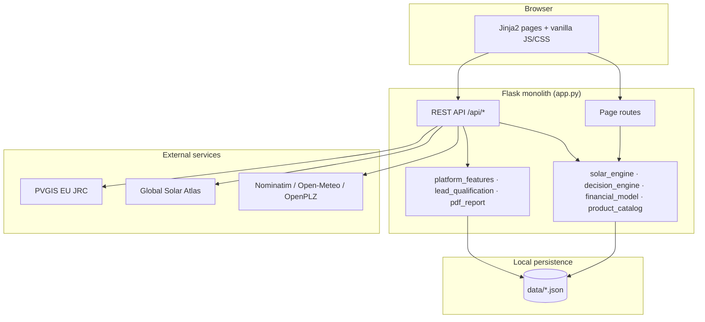

# Solar Path — System Architecture

**Product:** Bavaria-focused home energy platform (PV sizing, installer matching, quote comparison)  
**Pattern:** Monolithic Flask application with server-rendered UI and REST JSON APIs  
**Stage:** MVP / prototype — JSON file storage, container-ready, CI/CD scaffolded

---

## High-level diagram



---

## Layer responsibilities

| Layer | Technology | Responsibility |
|-------|------------|----------------|
| **Presentation** | Jinja2 templates, CSS (`static/css/`), JS (`static/js/`) | Pages, wizard UX, i18n in browser via `APP_TRANSLATIONS` |
| **HTTP / routing** | Flask 3.x (`app.py`) | Page routes, REST endpoints, sessions, error handlers |
| **Domain logic** | Python modules | Sizing, goals→technology, ROI, compatibility, lead tiers |
| **Persistence** | JSON files in `data/` | Suppliers, quotes, surveys, catalog — no ORM (prototype) |
| **Integrations** | `requests` | PVGIS yield, geocoding, GSA validation |
| **Reporting** | ReportLab | Bilingual PDF decision reports |
| **Ops** | Docker, GitHub Actions, Azure workflow | Build, test, deploy |

---

## Core data flow: Calculator


---

## API surface (selected)

| Method | Path | Purpose |
|--------|------|---------|
| GET | `/health` | Health probe for Azure / load balancers |
| POST | `/api/calculate` | PV recommendation (core feature) |
| GET | `/api/suppliers` | Postcode + radius installer search |
| POST | `/api/catalog/compatibility-check` | Panel/inverter/battery compatibility |
| POST | `/api/quotes/parse-text` | Quote text parsing for comparison |
| POST | `/api/quotes` | Submit lead / quote request |
| POST | `/api/report/pdf` | Download decision report |
| GET | `/api/admin/summary` | Admin stats (token-protected) |

Full route list: see `app.py` (~30 API endpoints).

---

## Data files

| File | Content |
|------|---------|
| `suppliers.json` | ~18k installers (PVR + OSM imports), Bayern filter |
| `product_catalog.json` | Panels, inverters, batteries |
| `quotes.json` | Customer quote / lead requests |
| `surveys.json` | Homeowner & B2B survey responses |
| `customers.json` | Registered users |
| `city_coords.json` | Geocoding cache |

**Upgrade path:** PostgreSQL for transactional data; Blob storage for uploads; Redis for geocode cache.

---

## Environments

| Env | Where | How |
|-----|-------|-----|
| **Dev** | Developer laptop | `python app.py` or `docker compose up` |
| **Stage** | GitHub Codespaces | `.devcontainer/devcontainer.json` |
| **Live** | Azure Web App for Containers | `.github/workflows/deploy-azure.yml` |

See [DEPLOYMENT.md](./DEPLOYMENT.md) for commands and secrets.

---

## Security notes (prototype)

- `SECRET_KEY` and `ADMIN_TOKEN` via environment variables
- Admin API uses header `X-Admin-Token` or query param
- No production-grade user auth yet (session for language only)
- Legal pages are template placeholders

---

## Module map

```
app.py                 Flask routes + JSON CRUD
solar_engine.py        Recommendation orchestration
decision_engine.py     Goal → technology mapping
financial_model.py     Payback, savings, tariffs
product_catalog.py     Component DB + compatibility rules
platform_features.py   Supplier matching, readiness scores
pvgis_client.py        PVGIS + geocoding
lead_qualification.py  Lead tier scoring
pdf_report.py          ReportLab PDF generation
i18n*.py               EN/DE translations
```

---

## Team roles mapping (course)

| Role | Solar Path ownership |
|------|---------------------|
| **Frontend** | Templates, CSS design system, calculator/compare/compatibility JS |
| **Backend** | Flask API, engines, JSON persistence, external API clients |
| **AI/ML (optional)** | Lead qualification scoring, quote parse stub, future yield ML |
