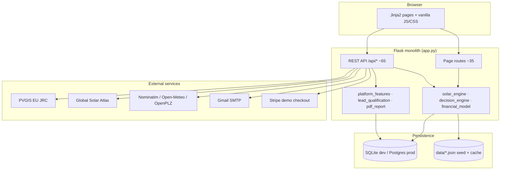
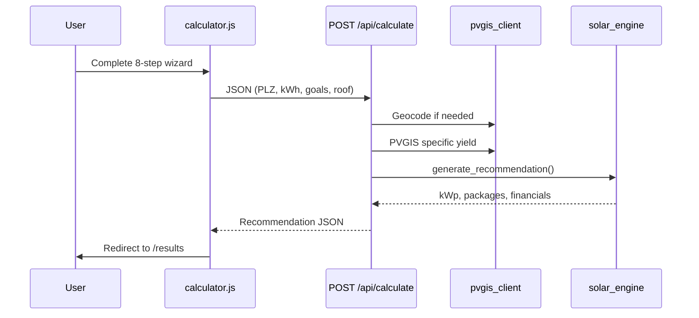

# Solar Path — System Architecture

**Product:** Bavaria-focused home energy platform (PV sizing, installer matching, quote comparison)
**Pattern:** Monolithic Flask application with server-rendered UI and REST JSON APIs
**Stage:** Production MVP on Render — SQLAlchemy persistence, hybrid JSON for legacy reads
**Live:** https://solar-path.onrender.com

---

## High-level diagram



---

## Layer responsibilities

| Layer | Technology | Responsibility |
|-------|------------|----------------|
| **Presentation** | Jinja2 templates (~40 HTML), CSS (`static/css/`), JS (`static/js/`) | Pages, wizard UX, i18n via `APP_TRANSLATIONS` |
| **HTTP / routing** | Flask 3.x (`app.py`, ~2,785 lines, ~100 routes) | Page routes, REST endpoints, sessions, middleware |
| **Domain logic** | Python modules (~16k LOC) | Sizing, goals→technology, ROI, compatibility, lead tiers |
| **Persistence** | SQLAlchemy 2 (`database.py`) | Customers, quotes, suppliers, subscriptions, EV entities |
| **Seed / cache** | JSON in `data/` | Supplier seed, product catalog, geocode cache, surveys |
| **Integrations** | `requests`, ReportLab, Stripe | PVGIS, geocoding, PDF reports, payments |
| **Ops** | Docker, GitHub Actions, Render, Neon | CI/CD, health probes, Postgres in production |

---

## Core data flow: Calculator



---

## API surface (selected)

| Method | Path | Purpose |
|--------|------|---------|
| GET | `/health` | DB, email, Stripe, beta gate status |
| POST | `/api/calculate` | PV recommendation (core feature) |
| POST | `/api/quick-estimate` | 60-second pre-estimate |
| GET | `/api/suppliers` | Postcode + radius installer search |
| POST | `/api/catalog/compatibility-check` | Panel/inverter/battery compatibility |
| POST | `/api/quotes/parse-text` | Quote text parsing (regex stub) |
| POST | `/api/quotes` | Submit lead / quote request |
| POST | `/api/report/pdf` | Download decision report |
| GET | `/api/admin/summary` | Admin stats (token-protected) |
| POST | `/api/ev-match` | EV vehicle matching |

Full route list: see `app.py` (~100 routes total).

---

## Data storage

### SQLAlchemy (primary)

| Table / area | Content |
|--------------|---------|
| `suppliers` | Installer directory (~105 curated; expandable via import scripts) |
| `customers` | Registered homeowner accounts |
| `quotes` | Lead / quote requests |
| `subscriptions` | Supplier plan checkouts |
| `assessments` | Saved calculator runs |
| `documents` | Customer document metadata |
| EV tables | Dealers, vehicles, leads, billing |

**Local dev:** SQLite (`data/solarpath.db`) when `DATABASE_URL` is unset.
**Production:** PostgreSQL via [Neon](https://neon.tech) — set `DATABASE_URL` on Render (see [DEPLOYMENT.md](./DEPLOYMENT.md)).

Schema is created with `Base.metadata.create_all()` on startup. Legacy JSON is imported once when tables are empty.

### JSON files (seed / hybrid)

| File | Content |
|------|---------|
| `suppliers.json` | Seed data for supplier migration |
| `product_catalog.json` | Panels, inverters, batteries |
| `demo_recommendation.json` | Fixed München demo for `/demo` |
| `surveys.json` | Survey responses (file-backed) |
| `city_coords.json` / `geo_cache.json` | Geocoding cache |
| `ev_vehicles.json` | EV marketplace catalog |

**Upgrade path:** Alembic migrations; blob storage for uploads; Redis for geocode cache.

---

## Environments

| Env | Where | Database | How |
|-----|-------|----------|-----|
| **Dev** | Developer laptop | SQLite | `START.bat` or `python app.py` |
| **Codespaces** | GitHub | Postgres (Docker) | `.devcontainer` + `docker-compose.codespaces.yml` |
| **Live** | Render | Neon Postgres | `render.yaml` + `DATABASE_URL` in dashboard |

See [README.md](../README.md), [DEPLOYMENT.md](./DEPLOYMENT.md), [CODESPACES.md](./CODESPACES.md).

---

## Security

- `SECRET_KEY` and `ADMIN_TOKEN` via environment (validated in production by `config.py`)
- Customer, supplier, and EV dealer sessions with bcrypt passwords
- Admin API: `X-Admin-Token` header or query param
- Security headers + CSP in production (`http_middleware.py`)
- Auth anomaly lockout (`anomaly_detection.py`, `security_events.py`)
- PII redaction in logs (`compliance.py`)
- Secrets (`DATABASE_URL`, `SMTP_PASSWORD`) set in Render dashboard — not committed
- Optional beta gate (`beta_access.py`)

Legal pages (`/privacy`, `/terms`) are template placeholders.

---

## Module map

```
app.py                 Flask routes + API orchestration
database.py            SQLAlchemy models + init_db()
solar_engine.py        Recommendation orchestration
decision_engine.py     Goal → technology mapping
financial_model.py     Payback, savings, tariffs
product_catalog.py     Component DB + compatibility rules
platform_features.py   Supplier matching, readiness scores
supplier_store.py      Supplier DB + JSON migration
pvgis_client.py        PVGIS + geocoding (retry + cache)
lead_qualification.py  Lead tier scoring
pdf_report.py          ReportLab PDF generation
email_service.py       SMTP notifications
stripe_checkout.py     Supplier subscription checkout
ev_marketplace.py      EV hub, matching, listings
i18n*.py               EN/DE translations
beta_access.py         Beta gate + invite tokens
```

**Note:** `quote_parse_stub.py` is an intentional regex stub for quote parsing.

---

## Testing & CI

- **149 pytest tests** across 25 modules
- CI matrix: Ubuntu, Windows, macOS
- Coverage gate 60% (`pyproject.toml`)
- Docker smoke test + UI smoke (`scripts/ui_smoke_check.py`)
- CodeQL static analysis

---

## Team roles mapping (course)

| Role | Solar Path ownership |
|------|---------------------|
| **Frontend** | Templates, CSS design system, calculator/results/compare JS |
| **Backend** | Flask API, engines, SQLAlchemy, external API clients |
| **DevOps** | Docker, Render, Neon, GitHub Actions |
| **AI/ML (optional)** | Lead qualification scoring, quote parse stub, future yield ML |

---

## Related docs

- [BACKLOG.md](./BACKLOG.md) — product backlog
- [DEPLOYMENT.md](./DEPLOYMENT.md) — Neon + Render setup
- [RUBRIC.md](./RUBRIC.md) — course rubric mapping
- [DEMO_MODE.md](./DEMO_MODE.md) — beta gate and public demo
